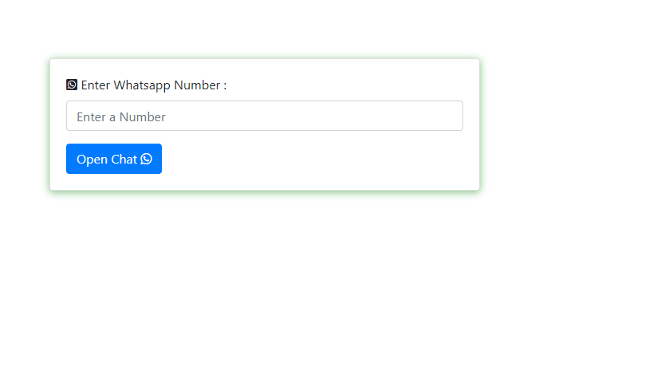

# Unknown Messanger 

It is a Simple tool for open whatsapp chat without save a contact , Whatsapp has Doesn't any Tool or Features in which User Directly Without save any contact details it can chat with other So I have Develope a Tool for that and it's a Very simple & Easy to use.

User have enter whatsapp Number and click on Button tool simply redirect to you your whatsapp chat without save contact details

##### Note: Tool Not Store your Any Data It's Simply Redirect on wa.me/+91Your-Number*

### Screenshot

### Links

-  Live Site URL: [Open Chat Tool](https://milanbhojani.github.io/unknownmessager.github.io/)

### Built with

- HTML
- CSS
- JS
- BOOTSTRAPS

## Available Scripts

In the project directory, you can run Index.html File:

### `Go Live`

Runs the Tool in the Local Server. 
Open [http://localhost:3000](http://localhost:3000) to view it in the browser.

The page will reload if you make edits. 
You will also see any lint errors in the console.
