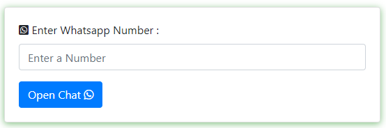

# Unknown Messanger 

It is a Simple tool for open whatsapp chat without save a contact

### Screenshot

### Links

-  Live Site URL: [Netlify](https://milanbhojani.github.io/unknownmessager.github.io/)

### Built with

- HTML
- CSS
- JS
- BOOTSTRAPS

## Available Scripts

In the project directory, you can run Index.html File:

### `Go Live`

Runs the Tool in the Local Server. 
Open [http://localhost:3000](http://localhost:3000) to view it in the browser.

The page will reload if you make edits. 
You will also see any lint errors in the console.

## Learn More

You can learn more in the [Create React App documentation](https://facebook.github.io/create-react-app/docs/getting-started).

To learn React, check out the [React documentation](https://reactjs.org/).
